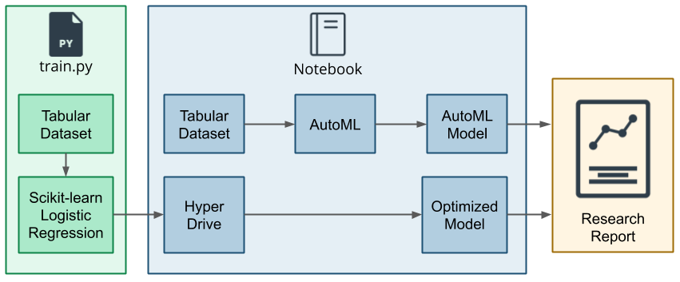
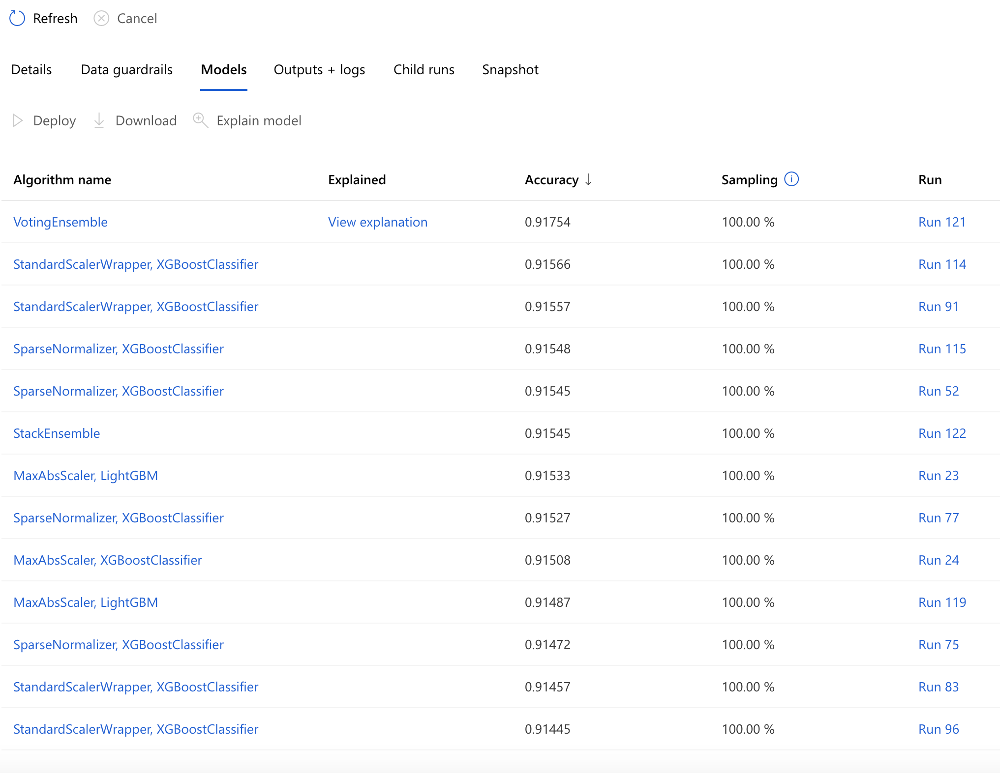

# Optimizing an ML Pipeline in Azure

## Overview
This project is part of the Udacity Azure ML Nanodegree.
In this project, we build and optimize an Azure ML pipeline using the Python SDK and a provided Scikit-learn model.
This model is then compared to an Azure AutoML run.

## Summary
The dataset contains about bank-marketing data, where the marketing dept made the call to the customer. The last column is labeld as 0 or 1.

This is a classification problem. We use both AutoML and Hyperdrive to solve this problem. We used TabularDatasetFactory to get the data, cleaned it and then ran bunch of model to get the best model.

The performance of both models are good. Though Automl model got 91.60% Accuracy and our hyperdrive got 91.59% Accuracy.

## Architecture Diagram

This is the diagram for both automl and hyper drive.

## Scikit-learn Pipeline
We used TabularDatasetFactory to load the data and clean data using pandas. The dataset is then split into 75/25.  All had been done in train.py Then we use SKLearn to run the train.py and feed hypderdrive config. The role of HypderDrive is then to vary the parameters C and max_iter so that the best performing model is found. We provided paramaeter space, sampling method, early termination policy, primary matric name and the goal to hyperdrive config to get the result.

By using parameter sampling I tuned hyperparameter and tried to find the suitable spot of the model. I just didn't do an memory hungry search such as Grid Search. I used both uniform and discreate search for two parameters sampler. Which will be robust and also give an acceptable result. I didn't used bayesian sampling also for the same reason. It picks samples based on how previous samples performed. So bayesian is also expensive.

We used early stopping policy to ensure that our model terminate poorly performing runs and save resources. We used BanditPolicy which ensure that any run will terminated if the primary matrics(Accuracy) of a run is less than the slack factor of best run. We use 0.1 for slack factor. The slack factor defines how far off the primary metric of a run must be from the best performing run's for it to be terminated. Bandit is going to ensure that the train will continue untill the Accuracy won't drop more than the slack factor or It will terminate. That's why I choose BanditPolicy instead of Median Stopping Policy or Truncation selection policy.

## AutoML
The AutoML is configured to allow 5 croos validation for the classification task. The models were XGBoost, LightGBM, RandomForests, BoostedTrees, SGDClassifier with varying input preprocessing normalizations like: Min Max Scaling, Standard Scaling etc. The model output is a pipeline with 2 steps. 
- datatransformer
- prefittedsoftvotingclassifier
 
The output shows that the datatransformer hyperparameters are set to None. For the classifier hyperparameters, penalty is set to l2 and max_iter is set to 1000. 
Here is the output of all the model it found best:

## Pipeline comparison
Both models are very good. Though AutoML got a slightly better because of trying out lots of models(54 models to be exact). And found out that VotingEnsemble is the best model(91.60% Accuracy). It also give warning about the imbalance of the dataset and how it may impact accuracy. Where in Hyperdrive it only used logistic regression model. In architecture AutoML was better because it tried a lot of different models, which was quite impossible if we have to do the same task with Hyperdrive because you have to create pipeline for every model.
Also in hyperdrive we first cleaned  the dataset and fed into logistic regression model before we passed it into the hyperdrive for hyperparameter tuning. On the otherhand the cleaned data directly feed into the configure AutoML, which then output the best model.

## Future work
I would like to add more hyper parameters to tweak the model more in depth to see the result. 
Also I will move the cleaning data process into different pipeline and will try out different normalization technique.
